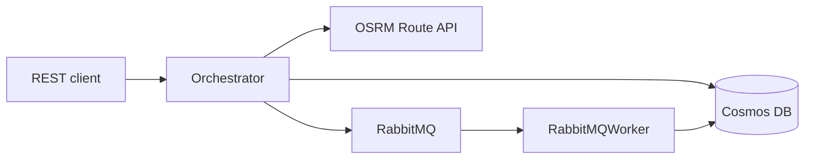

<div align="center">

# CycleNest

### SOA rental orchestrator — REST API, Cosmos DB, RabbitMQ, and OSRM

[](https://openjdk.org/)
[]()
[](https://azure.microsoft.com/products/cosmos-db/)
[](https://www.rabbitmq.com/)

<br/>

[]()
[]()
[]()

<br/>

[](https://github.com/hackerbotfz/CycleNest/commits)

<br/>

**[Faiz Lawan](https://github.com/hackerbotfz)**

</div>

---

**CycleNest** is a service-oriented rental middleware inspired by peer-to-peer hire platforms. A Java **Orchestrator** exposes REST endpoints for browsing items, proximity search, and rental requests. Data persists in **Azure Cosmos DB**; write-heavy booking traffic is queued through **RabbitMQ**; driving distance uses the public **OSRM** route API.

## Overview

| Component | Role |
|-----------|------|
| **Orchestrator** | JAX-RS (Jersey) WAR on Tomcat 9 |
| **Cosmos DB** | JSON documents for items and rental requests |
| **RabbitMQ** | Async queue for new rental requests |
| **OSRM** | Driving-distance filter for proximity search (~20 km) |
| **Worker** | `RabbitMQWorker` consumes the queue and writes to Cosmos |

## Architecture



## API

Base path: `/CycleNestOrchestrator/api`

| Endpoint | Method | Description |
|----------|--------|-------------|
| `/items` | `GET` | List available items (`category`, `maxPrice` filters) |
| `/items/proximity` | `GET` | Items within ~20 km driving distance (`lat`, `lon`) |
| `/items/{id}/proximity` | `GET` | Distance to one item (`userLat`, `userLon`) |
| `/requests` | `POST` | Queue a rental request (async via RabbitMQ) |
| `/requests/{id}/cancel` | `PUT` | Cancel a request |

## Tech stack

Java 21 · Jersey · Maven · Tomcat 9 · Azure Cosmos SDK · RabbitMQ · OkHttp · Jackson · Docker

## Configuration

Copy `.env.example` and set environment variables before running Tomcat or Docker:

| Variable | Purpose |
|----------|---------|
| `COSMOS_ENDPOINT` | Cosmos DB account URI |
| `COSMOS_KEY` | Cosmos DB primary key |
| `COSMOS_DATABASE` | Database name |
| `COSMOS_ITEMS_CONTAINER` | Items container (default: `sleeptype`) |
| `COSMOS_REQUESTS_CONTAINER` | Requests container (default: `Request`) |
| `RABBITMQ_HOST` | RabbitMQ host (default: `localhost`) |

## Build & run

```bash
mvn clean package
# Deploy target/CycleNestOrchestrator.war to Tomcat 9
# Start RabbitMQ, then run the worker:
java -cp target/CycleNestOrchestrator/WEB-INF/lib/*:target/CycleNestOrchestrator/WEB-INF/classes com.cycle_nest.queue.RabbitMQWorker
```

Service URL: `http://localhost:8080/CycleNestOrchestrator/api/items`

### Docker

```bash
docker build -t cyclenest-orchestrator .
docker run -p 8080:8080 \
  -e COSMOS_ENDPOINT=... -e COSMOS_KEY=... \
  -e RABBITMQ_HOST=host.docker.internal \
  cyclenest-orchestrator
```

Run `RabbitMQWorker` separately with the same Cosmos and RabbitMQ environment.

## Repository

```
CycleNest/
├── pom.xml
├── Dockerfile
├── src/main/java/com/cycle_nest/
│   ├── api/          # JAX-RS resources
│   ├── db/           # Cosmos DB client
│   ├── model/        # Item, RentalRequest
│   ├── queue/        # RabbitMQ producer + worker
│   └── service/      # OSRM distance service
├── src/main/webapp/
└── README.md
```

## License

© Faiz Lawan. See [LICENSE](LICENSE).
